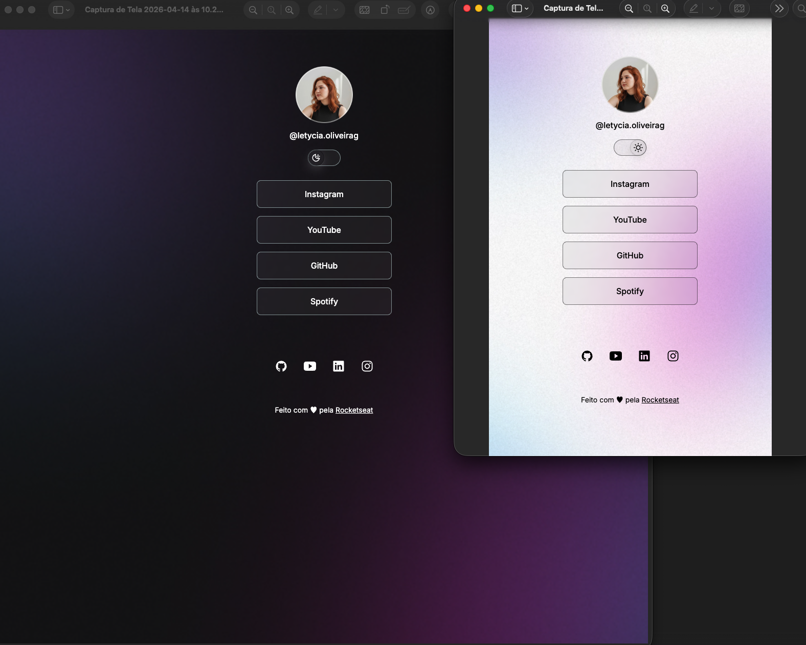

<h1 align="center">DevLinks</h1>

  Programa exclusivo e gratuito, promovido para ensino de tecnologias WEB da Rocketseat ♥.
   
  

  <a href="#-tecnologias">Tecnologias</a>&nbsp;&nbsp;&nbsp;|&nbsp;&nbsp;&nbsp;
  <a href="#-projeto">Projeto</a>&nbsp;&nbsp;&nbsp;|&nbsp;&nbsp;&nbsp;
  <a href="#-layout">Layout</a>&nbsp;&nbsp;&nbsp;|&nbsp;&nbsp;&nbsp;
  <a href="#memo-licença">Licença</a>

  

 

  

## 💻 Projeto

Este é o meu primeiro projeto de front-end, desenvolvido com o objetivo de praticar os fundamentos de HTML, CSS e JavaScript.

O DevLinks é um agregador de links que funciona como um cartão de visitas online.

## 🧠 Aprendizados

Durante o desenvolvimento, eu pratiquei:

- Estruturação com HTML semântico
- Estilização com CSS
- Manipulação de elementos com JavaScript
- Organização de código
- Responsividade

## 🚀 Próximos passos

- Melhorar a responsividade
- Adicionar animações
- Trabalhar na acessibilidade

## 🚀 Tecnologias

Esse projeto foi desenvolvido com as seguintes tecnologias:

- HTML e CSS
- JavaScript
- Git e Github
- Figma

## 🔖 Layout

Você pode visualizar o layout do projeto através [DESSE LINK](https://www.figma.com/community/file/1187422022288947321). É necessário ter conta no Figma para acessá-lo.

 

Esse projeto está sob a licença MIT.

<footer>
    Feito com ♥ pela <a href="https://rocketseat.com.br/">Rocketseat</a>
  </footer>